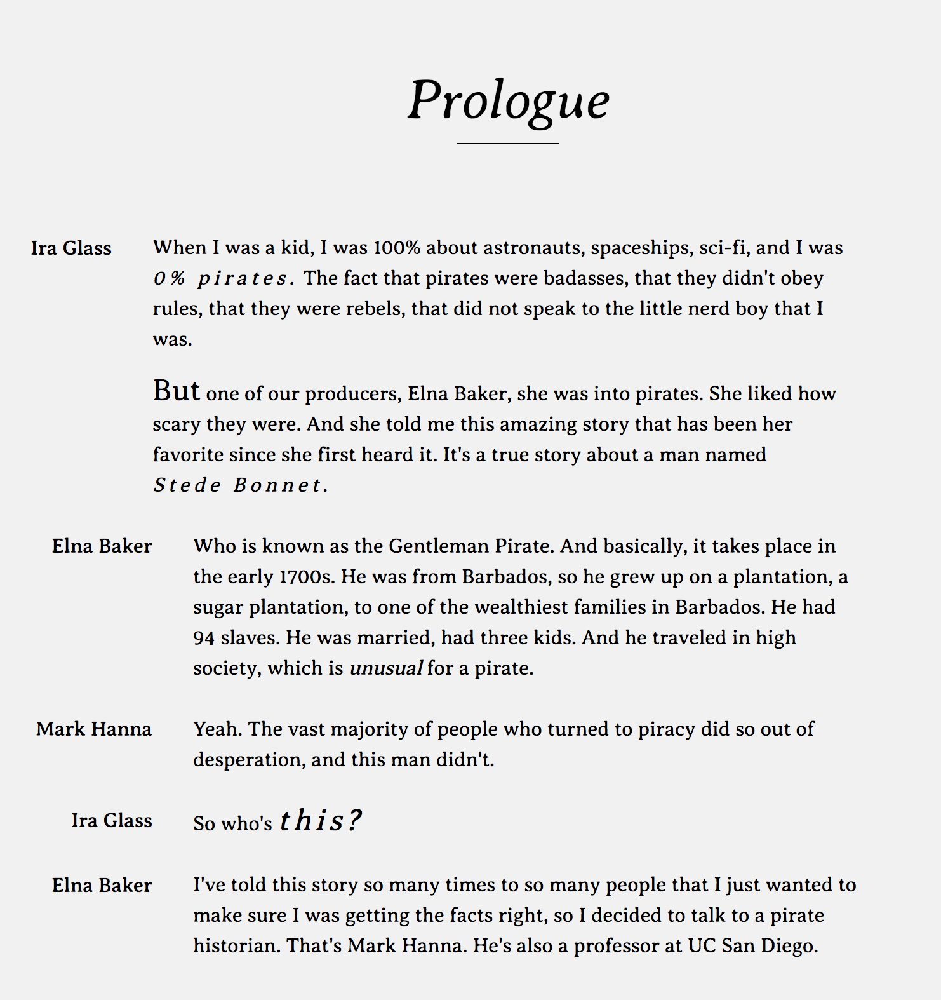

# Web Design @cmda-minor-web 1819 ⚓️

In this course I tried to make a podcast enjoyable for Marie, who has been deaf by birth.

## Week 1

    
Screencap week1

In the first few days we didn't even meet Marie, so I had to work with only my assumptions.
I assumed that typography would be my key to victory.
I made text bigger where people spoke louder than usual, Italic when things we're asked.

That wednesday we finaly meet her and let he test our prototypes based on our assumptions.
I could basically throw all my typography related ideas out the window.
Marie didn't associate **bolded**,*italic* or anything else for that matter with emotions since she doesn't have the same mental model as someone that does hear.

I now know I had to look into making the conversation more visual.

## Research

    
Plutchik's Wheel of Emotions

[Plutchik's color wheel Theory](https://en.wikipedia.org/wiki/Robert_Plutchik)

