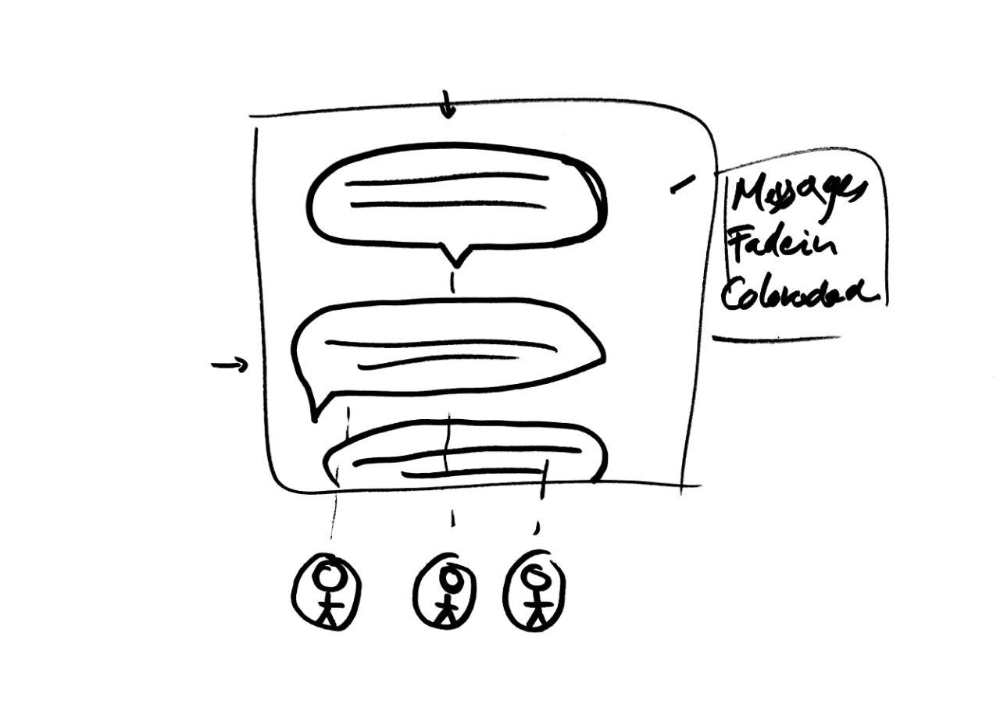

# Web Design @cmda-minor-web 1819 ⚓️

In this course I tried to make a podcast enjoyable for Marie, who has been deaf by birth.

## Week 1

    
Screencap week1

    
Sketches

In the first few days we didn't even meet Marie, so I had to work with only my assumptions.
I assumed that typography would be my key to victory.
I made text bigger where people spoke louder than usual, Italic when things we're asked.

That wednesday we finaly meet her and let he test our prototypes based on our assumptions.
I could basically throw all my typography related ideas out the window.
Marie didn't associate **bolded**,*italic* or anything else for that matter with emotions since she doesn't have the same mental model as someone that does hear.

I now know I had to look into making the conversation more visual.

## Week 2

    
Screencap week2

    
Sketches

I tried to make the conversation feel more like a conversation with the next iteration.
I used "female" and "male" colors for the speakers. They should be included to get a better idea of who's talking.
Along with this I faded in the text balloons in the hope to make it at least a little bit more interesting.

The feedback was quite liberating. I was heading in the right direction, but it was still a bit boring and still lacked the emotion I was looking for.
The portraits we're according to Marie not that well connected to the content.

## Week 3

    
Screencap week3

    
Sketches

### Research week 3

I made some minor improvements, I added a few animations within the text balloons and tested these with Roobin since I missed my 3rd test with Marie due to illness.

    
User Test

His feedback was quite positive aswell, but he found that it still lacked some personality and context about the "Pirates".

My findings came down do these 2 points
- Could use more thematic charm
- Could be more lifely

With this feedback I tried to focus on making the podcast more lifely.
I tried to add faces and better animations to better portray the emotions of the speakers.

I made the faces corrospond with the emotions that are "spoken".
Also I tried to better convey the way things are spoken with animations and colors based on the Plutchik's wheel of emotions.

    
Plutchik's Wheel of Emotions

[Plutchik's color wheel Theory](https://en.wikipedia.org/wiki/Robert_Plutchik)

